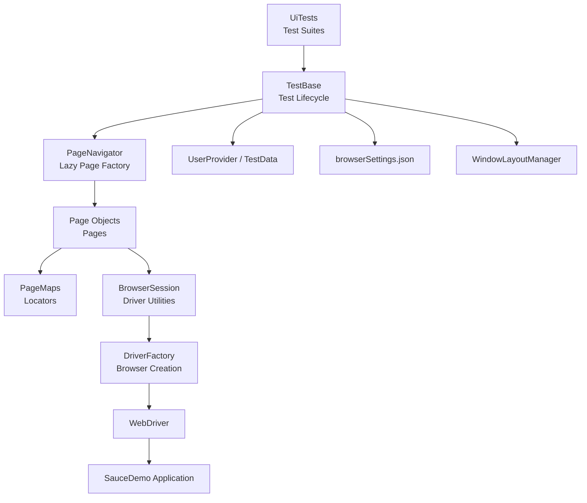

# 🧪 TestFramework

A **Selenium UI test automation framework** built with **.NET 8**, **NUnit 4**, and the **Page Object Model** pattern. Designed for parallel execution, easy extensibility, and clean separation between test logic and infrastructure.

> **Target application:** [SauceDemo](https://www.saucedemo.com/) — a demo e-commerce site by Sauce Labs.

---

## 📁 Solution Structure

---

## 🚀 Getting Started

### Prerequisites

- .NET SDK 8.0 or later — https://dotnet.microsoft.com/download/dotnet/8.0
- One of: Chrome, Firefox, or Edge installed
- Visual Studio 2022 (recommended)

### Clone & Build

    git clone https://github.com/BrownBear9208/TestFramework.git
    cd TestFramework
    dotnet build

### Run All Tests

    dotnet test

### Choose a Browser

PowerShell:
    $env:BROWSER="Chrome"; dotnet test

CMD:
    set BROWSER=Chrome && dotnet test

Linux / macOS:
    BROWSER=Chrome dotnet test

Supported values: Chrome, Firefox, Edge (default: Edge)

### Filter by Category

    dotnet test --filter "Category=Smoke"
    dotnet test --filter "Category=Regression"

### Filter by Fixture

    dotnet test --filter "FullyQualifiedName~LoginTests"
    dotnet test --filter "FullyQualifiedName~EndToEndTests"

### Run with CI Settings

    dotnet test -s UiTests/ci.runsettings

---

## ⚙️ Configuration

### browserSettings.json

- baseUrl              — Default URL when no TEST_ENV is set
- environments         — Named URLs keyed by dev, staging, production
- browsers.X.headless  — debug: false (local) / server: true (CI)
- browsers.X.windowSize — Default window size ("1920,1080")
- browsers.X.arguments — Extra CLI args per browser
- timeouts.implicitMs  — Selenium implicit wait (default 0)
- timeouts.pageLoadMs  — Page load timeout (default 60000)

### Users.json

Each entry maps to a UserType enum value:

- Standard    — standard_user            — Normal full-access user
- Locked      — locked_out_user          — Cannot log in
- Problematic — problem_user             — Broken UI elements
- Glitch      — performance_glitch_user  — Random delays
- Error       — error_user               — Server-side errors
- Visual      — visual_user              — Rendering bugs

### Environment Variables

- BROWSER   (default: Edge)    — Chrome, Firefox, or Edge
- TEST_ENV  (default: empty)   — Key from environments in browserSettings.json
- CI        (default: empty)   — When set, uses headless.server flag

---

## 🏗️ Architecture

### Page Object Model

Each page is a partial class split across two files:

    PageMaps/LoginPage.cs  → By locators only
    Pages/LoginPage.cs     → Actions and assertions

Locators and behavior are maintained independently — changing a selector never touches test logic.

### PageNavigator

All tests access pages through Pages.*:

    Pages.Login.WaitToLoad();
    Pages.Login.Login(UserType.Standard);
    Pages.Inventory.WaitToLoad();
    Pages.Inventory.AddItemToCartByName("Sauce Labs Backpack");
    Pages.Inventory.GoToCart();
    Pages.Cart.WaitToLoad();

Pages are lazily created and cached per test instance.

### TestBase

Every test fixture inherits TestBase, which handles:

- [SetUp]  — resolves browser, loads settings, claims a screen slot, creates driver, navigates to base URL
- [TearDown] — captures screenshot on failure, releases slot, quits browser
- Navigation helpers — LoginAsStandard(), NavigateToCheckoutStepOne(...), NavigateToCheckoutStepTwo(...), NavigateToCheckoutComplete(...)

### Parallel Execution

    ┌─────────────────────────────────────────────────────┐
    │                   1920 × 1080 screen                 │
    ├─────────────────┬─────────────────┬─────────────────┤
    │    Slot 0       │    Slot 1       │    Slot 2       │
    │    640×1080     │    640×1080     │    640×1080     │
    │    Browser #1   │    Browser #2   │    Browser #3   │
    └─────────────────┴─────────────────┴─────────────────┘

- [FixtureLifeCycle(InstancePerTestCase)] — Each test gets its own class instance + browser
- [Parallelizable(ParallelScope.Children)] — Tests within a fixture run in parallel
- [assembly: LevelOfParallelism(3)] — Max 3 concurrent browsers
- WindowLayoutManager — Claims slots before driver creation, injects --window-position and --window-size as launch args so browsers open directly in place

---

## 📊 Test Inventory (61 tests)

- LoginTests      — 6 tests  — Standard, Locked, Problematic, Glitch, Error, Visual
- InventoryTests   — 12 tests — Header, item names, prices, images, add/remove cart, sort (4 modes), logout
- CartTests        — 10 tests — Header, empty cart, add/remove items, prices, quantities, badge persistence, navigation
- CheckoutTests    — 24 tests — Step 1: header, valid submit, 3 empty field errors, all-empty, cancel, form input. Step 2: header, items, prices, quantities, payment/shipping, subtotal/tax/total math, finish, cancel. Complete: header, thank-you, confirmation text, pony express image, back home
- EndToEndTests    — 9 tests  — Single item purchase, multi-item purchase, remove-then-buy, cancel at step 1, cancel at step 2, continue-shopping flow, sort-then-buy, all 6 items, logout after purchase

---

## 🔧 Adding a New Page

3 steps, zero changes to TestBase or existing tests:

1. Locators — create SeleniumTestbase/PageMaps/NewPage.cs

    public partial class NewPage
    {
        private readonly By _header = By.CssSelector("[data-test='title']");
    }

2. Behavior — create SeleniumTestbase/Pages/NewPage.cs

    public partial class NewPage(IWebDriver? driver, BrowserSession? session)
        : BasePage(driver, session)
    {
        public override void WaitToLoad() { WaitForElement(_header); }
        public string GetHeaderText() => GetText(_header);
    }

3. Register — add one line in PageNavigator.cs

    public NewPage NewPage => Get(() => new NewPage(_driver, _session));

4. Use in tests

    Pages.NewPage.WaitToLoad();

---

## 📦 Dependencies

Managed centrally via Directory.Packages.props:

- NUnit 4.2.2                              — Test framework
- NUnit3TestAdapter 4.6.0                   — VS Test Explorer integration
- Microsoft.NET.Test.Sdk 17.11.1           — Test host
- Selenium.WebDriver 4.31.0                — Browser automation
- Selenium.Support 4.31.0                  — WebDriverWait, SelectElement
- Newtonsoft.Json 13.0.3                   — JSON config deserialization
- DotNetSeleniumExtras.WaitHelpers 3.11.0  — ExpectedConditions
- RestSharp 112.3.0                        — API testing (available)
- FluentAssertions 6.12.0                  — Assertion library (available)

---

## 📝 License

This project is for educational and demonstration purposes.
