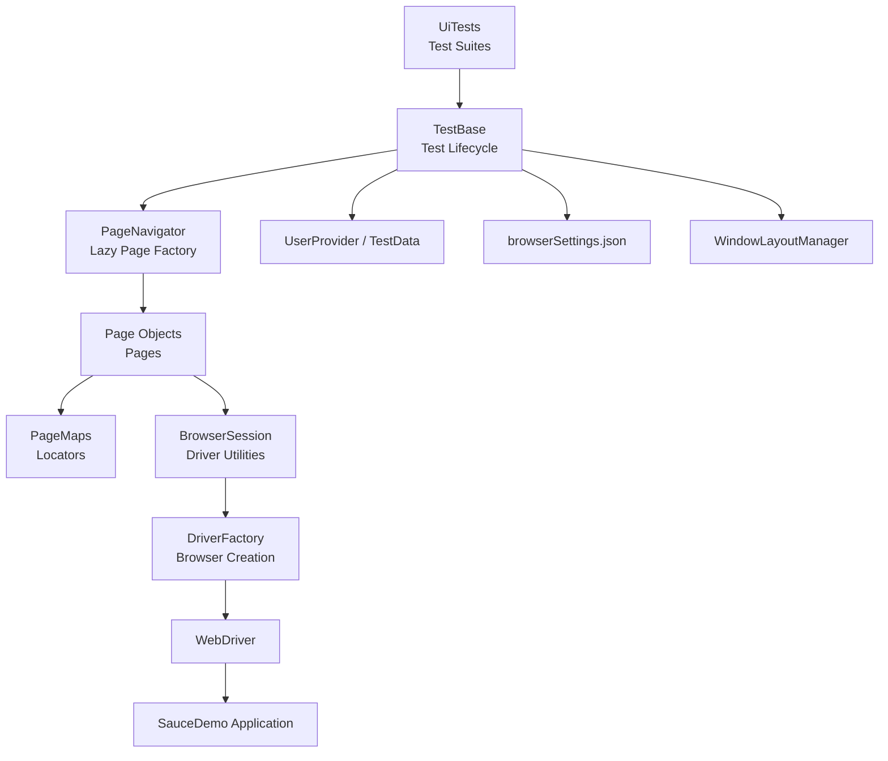
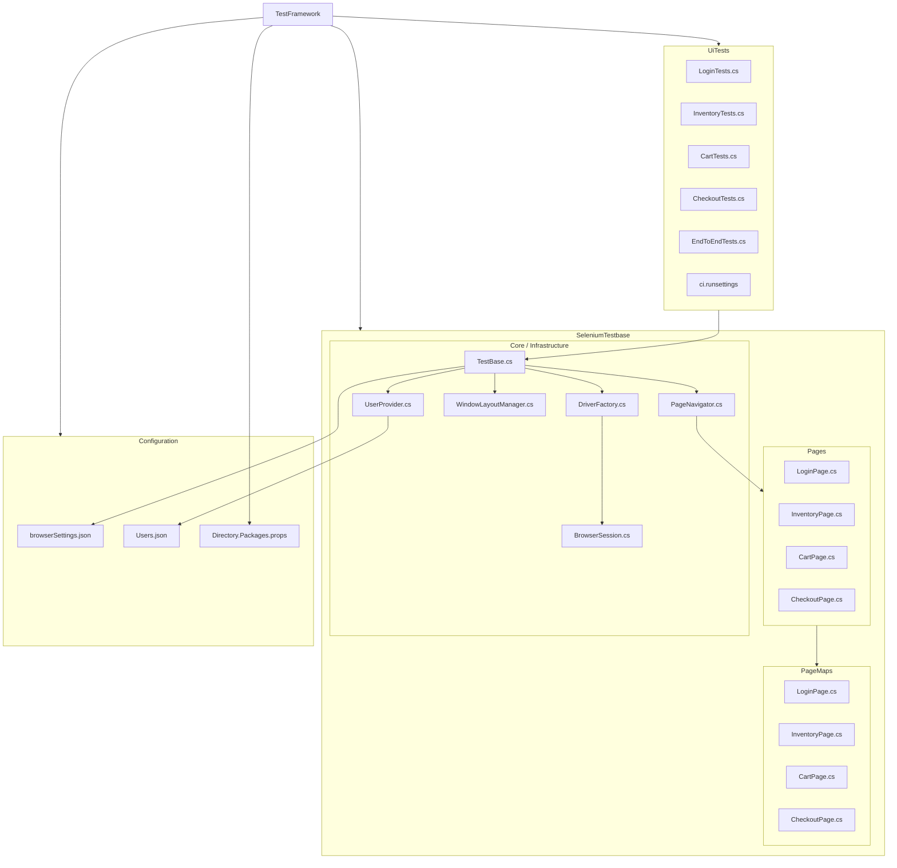

# 🧪 TestFramework — SauceDemo Selenium UI Automation


[](https://github.com/BrownBear9208/TestFramework/actions/workflows/ui-tests.yml)

A **Selenium UI test automation framework** built with **.NET 8**, **NUnit 4**, and the **Page Object Model** pattern. Designed for parallel execution, easy extensibility, and clean separation between test logic and infrastructure. > **Target application:** [SauceDemo](https://www.saucedemo.com/) — a demo e-commerce site by Sauce Labs.
Designed for **parallel execution**, **clean architecture**, **easy extensibility**, and **clear separation between test logic and infrastructure**.

**Repository:** https://github.com/BrownBear9208/TestFramework

---

# 🏗 Architecture



### Architecture Layers

| Layer | Responsibility |
|------|---------------|
| `UiTests` | Test suites and assertions |
| `TestBase` | Test lifecycle, setup, teardown, navigation helpers |
| `PageNavigator` | Lazy creation and caching of page objects |
| `Pages` | User actions and page behaviors |
| `PageMaps` | Selenium locators only |
| `BrowserSession` | Driver utility wrapper |
| `DriverFactory` | Browser initialization |
| `WindowLayoutManager` | Parallel browser slot allocation |
| `UserProvider / TestData` | Test users and data lookup |
| `browserSettings.json` | Environment and browser configuration |

---

# 📁 Solution Structure



---

# 🚀 Getting Started

## Prerequisites

- [.NET SDK 8.0 or later](https://dotnet.microsoft.com/download/dotnet/8.0)
- One of: **Chrome**, **Firefox**, or **Edge**
- **Visual Studio 2022** recommended

## Clone Repository

```bash
git clone https://github.com/BrownBear9208/TestFramework.git
cd TestFramework
```

## Build Solution

```bash
dotnet build
```

## Run All Tests

```bash
dotnet test
```

---

# 🌐 Browser Selection

## PowerShell

```powershell
$env:BROWSER="Chrome"; dotnet test
```

## CMD

```cmd
set BROWSER=Chrome && dotnet test
```

## Linux / macOS

```bash
BROWSER=Chrome dotnet test
```

### Supported Browsers

- `Chrome`
- `Firefox`
- `Edge` *(default)*

---

# 🎯 Run Specific Tests

## Filter by Category

```bash
dotnet test --filter "Category=Smoke"
dotnet test --filter "Category=Regression"
```

## Filter by Fixture

```bash
dotnet test --filter "FullyQualifiedName~LoginTests"
dotnet test --filter "FullyQualifiedName~EndToEndTests"
```

## Run with CI Settings

```bash
dotnet test -s UiTests/ci.runsettings
```

---

# ⚙️ Configuration

## `browserSettings.json`

| Key | Description |
|-----|-------------|
| `baseUrl` | Default URL when no `TEST_ENV` is set |
| `environments` | Named URLs keyed by `dev`, `staging`, `production` |
| `browsers.X.headless` | `debug: false` (local) / `server: true` (CI) |
| `browsers.X.windowSize` | Default browser window size, e.g. `1920,1080` |
| `browsers.X.arguments` | Extra launch arguments per browser |
| `timeouts.implicitMs` | Selenium implicit wait, default `0` |
| `timeouts.pageLoadMs` | Page load timeout, default `60000` |

## `Users.json`

Each user maps to a `UserType` enum value.

| User Type | Username | Purpose |
|----------|----------|---------|
| `Standard` | `standard_user` | Normal full-access user |
| `Locked` | `locked_out_user` | Cannot log in |
| `Problematic` | `problem_user` | Broken UI elements |
| `Glitch` | `performance_glitch_user` | Random delays |
| `Error` | `error_user` | Server-side errors |
| `Visual` | `visual_user` | Rendering bugs |

## Environment Variables

| Variable | Default | Description |
|----------|---------|-------------|
| `BROWSER` | `Edge` | `Chrome`, `Firefox`, or `Edge` |
| `TEST_ENV` | empty | Key from `environments` in `browserSettings.json` |
| `CI` | empty | When set, uses `headless.server` flag |

---

# 🧩 Core Design Patterns

## Page Object Model

Each page is a **partial class** split into two files:

- `PageMaps/LoginPage.cs` → locators only
- `Pages/LoginPage.cs` → actions and assertions

This keeps **locators** and **behavior** separated, so selector changes do not affect test logic.

## PageNavigator

All tests access pages through `Pages.*`

```csharp
Pages.Login.WaitToLoad();
Pages.Login.Login(UserType.Standard);
Pages.Inventory.WaitToLoad();
Pages.Inventory.AddItemToCartByName("Sauce Labs Backpack");
Pages.Inventory.GoToCart();
Pages.Cart.WaitToLoad();
```

Pages are **lazily created** and **cached per test instance**.

## TestBase

Every test fixture inherits from `TestBase`, which handles:

- browser resolution
- configuration loading
- screen slot allocation
- driver creation
- navigation to base URL
- screenshot capture on failure
- cleanup and browser disposal
- reusable navigation helpers

## Parallel Execution

```text
┌─────────────────────────────────────────────────────┐
│                   1920 × 1080 screen                │
├─────────────────┬─────────────────┬─────────────────┤
│    Slot 0       │    Slot 1       │    Slot 2       │
│    640×1080     │    640×1080     │    640×1080     │
│    Browser #1   │    Browser #2   │    Browser #3   │
└─────────────────┴─────────────────┴─────────────────┘
```

### Parallelization Strategy

- `[FixtureLifeCycle(InstancePerTestCase)]` — each test gets its own class instance and browser
- `[Parallelizable(ParallelScope.Children)]` — tests in a fixture run in parallel
- `[assembly: LevelOfParallelism(3)]` — maximum 3 concurrent browsers
- `WindowLayoutManager` — claims screen slots and injects `--window-position` / `--window-size` at launch

---

# 📊 Test Inventory

| Test Suite | Coverage Area | Count |
|-----------|---------------|------:|
| `LoginTests` | Standard, Locked, Problematic, Glitch, Error, Visual users | 6 |
| `InventoryTests` | Header, names, prices, images, add/remove, sorting, logout | 12 |
| `CartTests` | Header, empty cart, add/remove, prices, quantities, badge persistence, navigation | 10 |
| `CheckoutTests` | Step 1, Step 2, Complete page validations and flows | 24 |
| `EndToEndTests` | Purchase journeys, cancellations, sorting, full catalog, logout | 9 |

**Total Tests:** **61**

---

# ➕ Adding a New Page

## 1. Create locators

```csharp
public partial class NewPage
{
    private readonly By _header = By.CssSelector("[data-test='title']");
}
```

## 2. Create behavior

```csharp
public partial class NewPage(IWebDriver? driver, BrowserSession? session)
    : BasePage(driver, session)
{
    public override void WaitToLoad() => WaitForElement(_header);

    public string GetHeaderText() => GetText(_header);
}
```

## 3. Register in `PageNavigator.cs`

```csharp
public NewPage NewPage => Get(() => new NewPage(_driver, _session));
```

## 4. Use in tests

```csharp
Pages.NewPage.WaitToLoad();
```

---

# 📦 Dependencies

Managed centrally via `Directory.Packages.props`.

| Package | Purpose |
|---------|---------|
| `NUnit 4.2.2` | Test framework |
| `NUnit3TestAdapter 4.6.0` | Visual Studio Test Explorer integration |
| `Microsoft.NET.Test.Sdk 17.11.1` | Test host |
| `Selenium.WebDriver 4.31.0` | Browser automation |
| `Selenium.Support 4.31.0` | `WebDriverWait`, `SelectElement` |
| `Newtonsoft.Json 13.0.3` | JSON configuration deserialization |
| `DotNetSeleniumExtras.WaitHelpers 3.11.0` | ExpectedConditions helpers |
| `RestSharp 112.3.0` | API testing support |
| `FluentAssertions 6.12.0` | Assertion library support |

---

# ✅ Framework Highlights

- **.NET 8 + NUnit 4**
- **Selenium Page Object Model**
- **Partial-class split between locators and actions**
- **Parallel browser execution**
- **Lazy page initialization**
- **Centralized configuration**
- **Reusable navigation helpers**
- **Extensible page registration model**
- **Failure screenshots**
- **CI-friendly test execution**

---

# 📝 License

This project is for **educational and demonstration purposes**.
